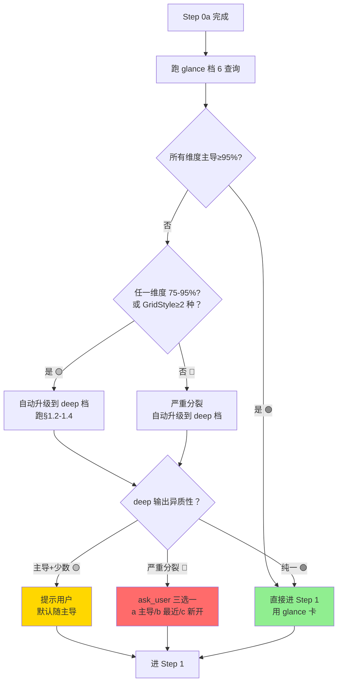
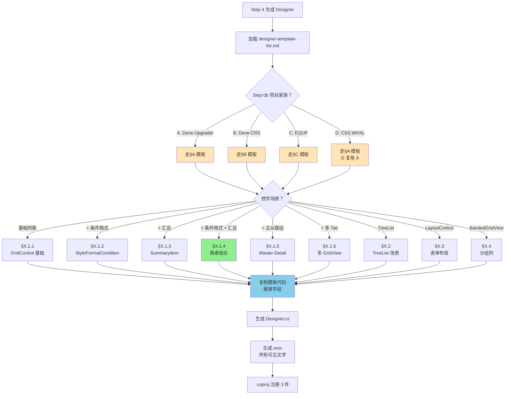
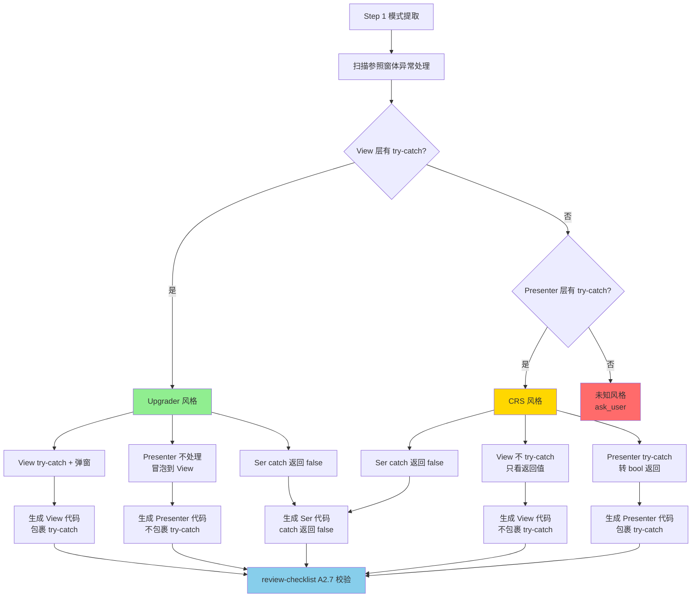
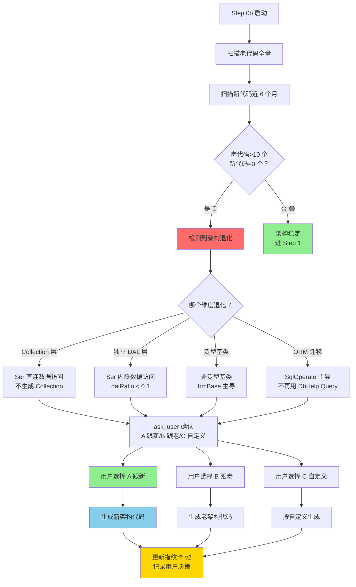
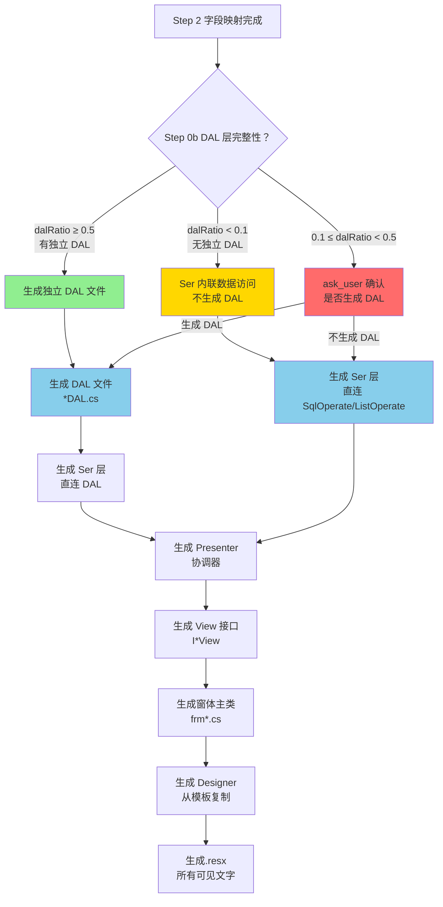
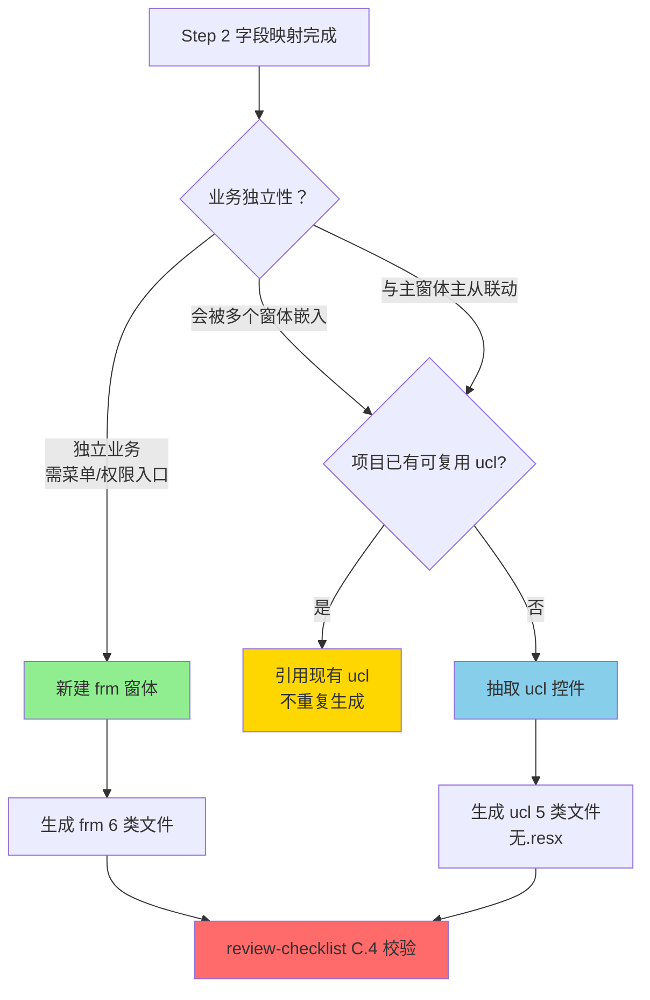
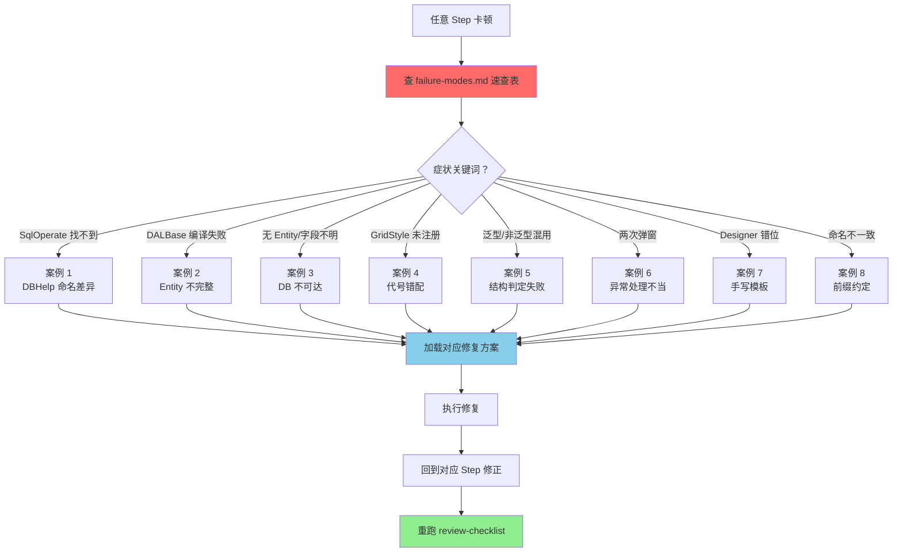
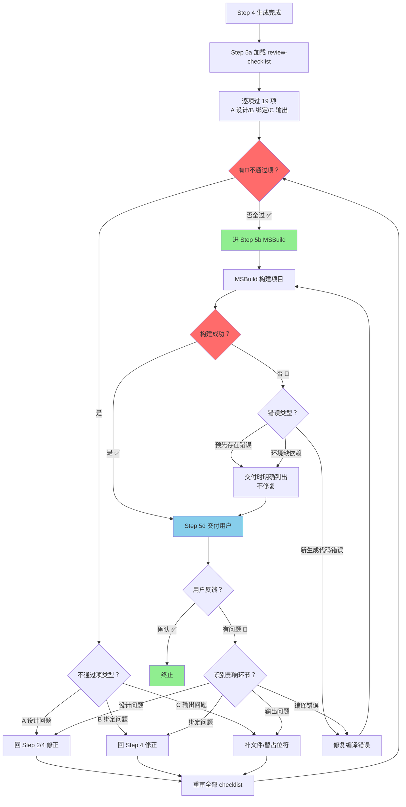

# winforms-dev-flow 可视化决策树

> 所有决策流程的图形化表示，便于 Agent 快速定位正确路径。

---

## 1. Step 0b 异质性判定决策树



---

## 2. Designer 模板选择决策树 (4 家族×6 场景)



---

## 3. 异常处理风格识别决策树



---

## 4. 架构退化检测决策树



---

## 5. 三层生成数据流向决策树



---

## 6. 复用决策 (frm vs ucl) 决策树



---

## 7. 失败案例速查决策树



---

## 8. Step 5 自审循环决策树



---

## 9. 完整流程总览决策树

```mermaid
graph TB
    Start[用户请求<br/>"加个 XX 窗体"] --> Step0[Step 0 定位目标目录]
    
    Step0 --> Step0a[Step 0a 4 项必填门]
    Step0a --> Step0b[Step 0b 项目指纹识别]
    
    Step0b --> Decision0{异质性等级？}
    Decision0 -->|🟢 纯一 | Step1
    Decision0 -->|🟡 主导 + 少数 | Step1
    Decision0 -->|🔴 严重分裂 | AskUser0[ask_user 三选一]
    
    AskUser0 --> Step1[Step 1 参照学习]
    
    Step1 --> Decision1{模式可判定？}
    Decision1 -->|否 🔴 | AskUser1[ask_user 列选项]
    Decision1 -->|是 ✅ | Step2
    
    AskUser1 --> Step2[Step 2 数据驱动布局]
    
    Step2 --> Step3[Step 3 复用决策 frm/ucl]
    Step3 --> Step4[Step 4 三层生成 + 绑定]
    
    Step4 --> Step5a[Step 5a review-checklist]
    Step5a --> Decision5a{全通过？}
    Decision5a -->|否 🔴 | Correct[回对应 Step 修正]
    Decision5a -->|是 ✅ | Step5b
    
    Correct --> Step5a
    
    Step5b[Step 5b MSBuild] --> Decision5b{构建成功？}
    Decision5b -->|否 🔴 | FixBuild[修复编译错误]
    Decision5b -->|是 ✅ | Step5d
    
    FixBuild --> Step5b
    
    Step5d[Step 5d 交付用户] --> Feedback{用户反馈？}
    Feedback -->|确认 ✅ | End[终止 ✅]
    Feedback -->|有问题 🔴 | Identify{识别影响环节}
    
    Identify -->|设计 | Correct
    Identify -->|绑定 | Correct
    Identify -->|输出 | Correct
    Identify -->|编译 | FixBuild
    
    style Step0b fill:#FFD700
    style Step1 fill:#87CEEB
    style Step4 fill:#87CEEB
    style Step5a fill:#FF6B6B
    style Step5b fill:#FF6B6B
    style End fill:#90EE90
```

---

## 使用说明

### Agent 快速定位指南

| 场景 | 查看决策树 | 关键节点 |
|------|-----------|---------|
| **项目风格不明** | 图 1 (Step 0b 异质性) | glance → deep 升级规则 |
| **Designer 模板选择** | 图 2 (4 家族×6 场景) | 家族判定 → 场景选择 |
| **异常风格确认** | 图 3 (异常处理识别) | View/Presentation/Ser 三层 |
| **架构退化检测** | 图 4 (架构退化) | 老代码 vs 新代码对比 |
| **分层生成决策** | 图 5 (三层数据流) | DAL 层完整性判定 |
| **复用决策** | 图 6 (frm vs ucl) | 业务独立性判定 |
| **失败案例速查** | 图 7 (失败案例) | 症状→案例映射 |
| **自审循环** | 图 8 (Step 5 自审) | review-checklist → MSBuild |
| **完整流程** | 图 9 (总览) | 8 Steps 全貌 |

### 决策树颜色说明

| 颜色 | 含义 |
|------|------|
| 🟢 绿色 | 正常流程/成功终止 |
| 🟡 黄色 | 警告/需注意 |
| 🔴 红色 | 异常/需用户决策 |
| 🔵 蓝色 | 代码生成动作 |

---

*最后更新：2026-07-10*
*维护指南：新增决策场景时，在本文件追加对应决策树，并同步更新 SKILL.md 的 References 节*
